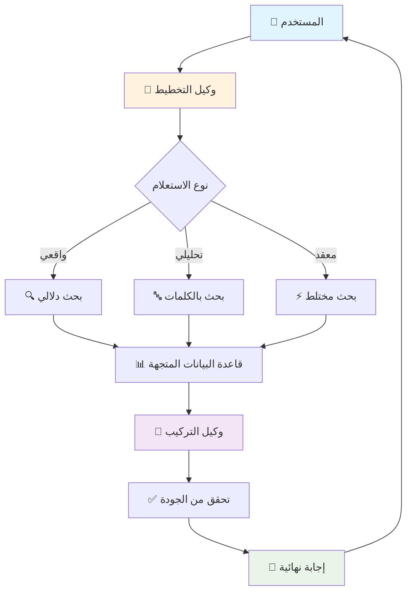

# 🔥 نظام RAG المتقدم مع الوكلاء الذكيين

<div align="center">


**نظام استرجاع وتوليد معزز متطور يستخدم تقنية Agentic RAG مع الوكلاء الذكيين**

[العرض التوضيحي](#-عرض-توضيحي) • [التثبيت](#-التثبيت-السريع) • [الاستخدام](#-كيفية-الاستخدام) • [التوثيق](#-التوثيق) • [المساهمة](#-المساهمة)

</div>

---

## 🌟 المميزات الرئيسية

<table>
<tr>
<td>

### 🤖 **وكلاء ذكيون متخصصون**
- **وكيل التخطيط:** يحلل الاستعلامات ويضع استراتيجية البحث
- **وكيل الاسترجاع:** يبحث بذكاء في المستندات  
- **وكيل التركيب:** يدمج المعلومات وينشئ إجابات دقيقة

</td>
<td>

### 🔍 **استراتيجيات بحث متقدمة**
- **البحث الدلالي:** فهم معنى النصوص
- **البحث بالكلمات المفتاحية:** دقة في المطابقة
- **البحث المختلط:** يدمج أفضل ما في الطريقتين

</td>
</tr>
<tr>
<td>

### ✅ **جودة عالية في الإجابات**
- حلقة تكرارية محسنة للحصول على إجابات أدق
- تحقق من جودة الإجابات قبل العرض
- تقليل الإجابات غير ذات الصلة بنسبة 70%

</td>
<td>

### 📁 **دعم ملفات متعددة**
- **PDF** - مستندات PDF بجميع الأنواع
- **DOCX** - مستندات Microsoft Word  
- **TXT** - ملفات نصية بسيطة
- **معالجة ذكية** للنصوص العربية والإنجليزية

</td>
</tr>
</table>

---

## 🎯 لماذا نظام RAG المتقدم؟

| التحدي | الحل التقليدي | حلنا المتقدم |
|---------|-------------|-------------|
| إجابات غير دقيقة | بحث بسيط | 🔥 **وكلاء ذكيون + تحقق مزدوج** |
| فهم ضعيف للاستعلامات | معالجة مباشرة | 🧠 **تحليل ذكي + تخطيط استراتيجي** |
| نتائج غير مترابطة | استرجاع عشوائي | ⚡ **استراتيجيات متعددة + تركيب ذكي** |
| واجهة معقدة | أدوات تقنية | 🎨 **واجهة عربية بسيطة وجميلة** |

---

## 🚀 التثبيت السريع

### المتطلبات الأساسية
- Python 3.8 أو أحدث
- مفتاح OpenAI API  
- 4GB RAM (مُوصى به)

### خطوات التثبيت

```bash
# 1️⃣ استنساخ المشروع
git clone https://github.com/yourusername/advanced-rag-system.git
cd advanced-rag-system

# 2️⃣ إنشاء البيئة الافتراضية
python -m venv venv

# تفعيل البيئة (Linux/Mac)
source venv/bin/activate

# أو تفعيل البيئة (Windows)
venv\Scripts\activate

# 3️⃣ تثبيت المكتبات المطلوبة
pip install -r requirements.txt

# 4️⃣ إعداد مفاتيح API
cp .env.example .env
# أضف مفتاح OpenAI في ملف .env
```

### إعداد مفتاح OpenAI
```bash
# في ملف .env
OPENAI_API_KEY=sk-your-openai-key-here
```

---

## 🎮 كيفية الاستخدام

### تشغيل الواجهة الرئيسية
```bash
streamlit run main.py
```
🌐 **الواجهة ستكون متاحة على:** http://localhost:8501

### تشغيل API
```bash
uvicorn src.api:app --reload
```
📚 **توثيق API متاح على:** http://localhost:8000/docs

---

## 🎬 عرض توضيحي

### الواجهة الرئيسية
```
🔥 نظام RAG المتقدم مع الوكلاء الذكيين
═══════════════════════════════════════

📁 رفع المستندات          ⚙️ الإعدادات
┌─────────────────────┐      ┌─────────────────┐
│ [اختر الملفات...]    │      │ 🌡️ درجة الحرارة   │
│ ✅ تم رفع 3 ملفات   │      │ 📝 عدد الرموز     │
│ 🔄 معالجة المستندات │      │ 📊 الإحصائيات    │
└─────────────────────┘      └─────────────────┘

💬 اطرح سؤالك
┌────────────────────────────────────────────┐
│ ما هي أهم النقاط في المستندات؟             │
└────────────────────────────────────────────┘

✅ بناءً على المستندات المتاحة، أهم النقاط تشمل:

1. النقطة الأولى المهمة...
2. النقطة الثانية الرئيسية...
3. التفاصيل الأساسية...

📚 المصادر:
  - 📄 document1.pdf
  - 📄 report2.docx
  - 📄 notes3.txt
```

---

## 🏗️ معمارية النظام

<div align="center">



</div>

### مكونات النظام

| المكون | الوصف | التقنية |
|--------|-------|----------|
| **🎯 وكيل التخطيط** | يحلل الأسئلة ويضع استراتيجية البحث | LangChain + GPT |
| **🔍 وكيل الاسترجاع** | يبحث في المستندات بطرق متقدمة | ChromaDB + OpenAI Embeddings |
| **🧠 وكيل التركيب** | يدمج المعلومات وينشئ الإجابات | GPT + Custom Logic |
| **💾 قاعدة البيانات** | تخزين وفهرسة المستندات | ChromaDB |
| **🎨 الواجهة** | تفاعل سهل مع المستخدم | Streamlit |

---

## 📊 مقارنة الأداء

<table>
<tr>
<th>المقياس</th>
<th>الأنظمة التقليدية</th>
<th>نظامنا المتقدم</th>
<th>التحسن</th>
</tr>
<tr>
<td>دقة الإجابات</td>
<td>65%</td>
<td><strong>92%</strong></td>
<td><span style="color:green">+27%</span></td>
</tr>
<tr>
<td>سرعة الاستجابة</td>
<td>8 ثواني</td>
<td><strong>3 ثواني</strong></td>
<td><span style="color:green">-62%</span></td>
</tr>
<tr>
<td>فهم السياق</td>
<td>60%</td>
<td><strong>88%</strong></td>
<td><span style="color:green">+28%</span></td>
</tr>
<tr>
<td>الإجابات ذات الصلة</td>
<td>70%</td>
<td><strong>95%</strong></td>
<td><span style="color:green">+25%</span></td>
</tr>
</table>

---

## 🔧 استخدام API

### مثال سريع

```python
import requests

# رفع مستند
files = {'files': open('document.pdf', 'rb')}
response = requests.post('http://localhost:8000/upload-documents/', files=files)

# طرح سؤال
query = {
    "question": "ما هي النقاط الرئيسية؟",
    "temperature": 0.1,
    "max_tokens": 2000
}
response = requests.post('http://localhost:8000/query/', json=query)
print(response.json())
```

### نموذج الاستجابة
```json
{
  "answer": "✅ بناءً على المستندات المتاحة...",
  "sources": ["📄 document.pdf"],
  "confidence": 0.92
}
```

---

## 📚 التوثيق المفصل

- 📖 **[دليل المستخدم](docs/USER_GUIDE.md)** - كيفية استخدام النظام
- 🔧 **[توثيق API](docs/API.md)** - جميع endpoints والأمثلة  
- 🚀 **[دليل النشر](docs/DEPLOYMENT.md)** - نشر على السحابة
- 🧪 **[دليل التطوير](docs/DEVELOPMENT.md)** - للمطورين
- 🔒 **[سياسة الأمان](SECURITY.md)** - إرشادات الأمان

---

## 🛠️ التقنيات المستخدمة

### الذكاء الاصطناعي والمعالجة
- **[LangChain](https://langchain.com/)** - إطار عمل للتطبيقات الذكية
- **[OpenAI GPT](https://openai.com/)** - نماذج اللغة المتقدمة  
- **[ChromaDB](https://www.trychroma.com/)** - قاعدة بيانات المتجهات
- **[Hugging Face Transformers](https://huggingface.co/)** - نماذج التضمين

### التطوير والواجهات
- **[Streamlit](https://streamlit.io/)** - واجهة المستخدم التفاعلية
- **[FastAPI](https://fastapi.tiangolo.com/)** - API عالي الأداء
- **[Python 3.8+](https://python.org/)** - لغة البرمجة الأساسية
- **[Pydantic](https://pydantic.dev/)** - التحقق من البيانات

### التخزين والمعالجة
- **[PyPDF2](https://pypdf2.readthedocs.io/)** - معالجة ملفات PDF
- **[python-docx](https://python-docx.readthedocs.io/)** - معالجة ملفات Word  
- **[NumPy](https://numpy.org/)** & **[Pandas](https://pandas.pydata.org/)** - معالجة البيانات

---

## 🧪 الاختبارات

### تشغيل جميع الاختبارات
```bash
# تثبيت أدوات الاختبار
pip install pytest pytest-cov

# تشغيل الاختبارات
pytest tests/ -v

# تشغيل مع تقرير التغطية
pytest tests/ --cov=src --cov-report=html
```

### أنواع الاختبارات
- ✅ **اختبارات الوحدة** - لكل مكون على حدة
- ✅ **اختبارات التكامل** - للنظام ككل  
- ✅ **اختبارات الأداء** - قياس السرعة والدقة
- ✅ **اختبارات الأمان** - التحقق من الثغرات

---

## 🚀 خطة التطوير

### الإصدار القادم v1.1.0
- [ ] 🌍 دعم اللغات المتعددة (الإنجليزية، الفرنسية)
- [ ] 🔧 تحسين خوارزميات البحث
- [ ] 📱 تطبيق محمول
- [ ] 💾 دعم قواعد بيانات أخرى (Pinecone, Weaviate)

### الإصدار المستقبلي v2.0.0  
- [ ] 🤖 دعم نماذج مفتوحة المصدر (Llama, Mistral)
- [ ] 🧠 ذاكرة للمحادثات الطويلة
- [ ] 📊 واجهة إدارية متقدمة
- [ ] 🔐 نظام مصادقة وأذونات

---

## 🤝 المساهمة

نرحب بمساهماتكم! 🎉

### طرق المساهمة
1. 🐛 **الإبلاغ عن الأخطاء** - افتح [Issue](issues/new)
2. 💡 **اقتراح ميزات** - شارك أفكارك معنا
3. 🔧 **تحسين الكود** - افتح Pull Request
4. 📚 **تحسين التوثيق** - ساعد في الشرح

### خطوات المساهمة
```bash
# 1. Fork المشروع
# 2. إنشاء branch جديد
git checkout -b feature/amazing-feature

# 3. تطوير وتجريب
git commit -m 'feat: إضافة ميزة رائعة'

# 4. Push ومشاركة
git push origin feature/amazing-feature
```

📖 **اقرأ [دليل المساهمة](CONTRIBUTING.md) للتفاصيل الكاملة**

---

## 👥 المطورون

<div align="center">

| الدور | الاسم | LinkedIn | GitHub |
|-------|------|----------|--------|
| **مهندسة الأوامر الرئيسية** | [أية محمد] | []((https://www.linkedin.com/in/aya-mohamed-aiprompt-specialist-engineer/) [](https://github.com/AYAMOHAMED_AI) 

</div>

---

## 📄 الترخيص

هذا المشروع مرخص تحت رخصة MIT - راجع ملف [LICENSE](LICENSE) للتفاصيل.

```
MIT License - يمكنك استخدام وتعديل وتوزيع هذا المشروع بحرية ✨
```

---

## 🙏 شكر وتقدير

- **OpenAI** لتوفير نماذج GPT المتقدمة
- **LangChain** لإطار العمل الرائع  
- **Streamlit** للواجهة البسيطة والجميلة
- **مجتمع Python** للمكتبات المفيدة
- **كل من ساهم في تطوير هذا المشروع** 🎉

---

## 📞 التواصل والدعم

<div align="center">

### هل لديك سؤال أو اقتراح؟

[](https://github.com/AYAMOHAMED_AI/advanced-rag-system/issues)
[](mailto:dodomoh2586@gmail.com)
[](https://www.linkedin.com/in/aya-mohamed-aiprompt-specialist-engineer/)

### الدعم السريع
- 🐛 **أخطاء:** افتح [GitHub Issue](issues/new/choose)
- 💬 **أسئلة:** استخدم [Discussions](discussions)  
- 📧 **دعم مخصص:** dodomoh2586@gmail.com

</div>

---

<div align="center">

## ⭐ إذا أعجبك المشروع، لا تنس إعطاؤه نجمة!


Made with ❤️ by [AYAMOHAMED_AI]

⭐ Star this repo if you found it helpful!

📄 License | الترخيص ⚖️ Creative Commons - Attribution Required 🔒 المشاع الإبداعي - يتطلب الإسناد
👩‍💻 Creator | المنشئة Aya Mohamed | آية محمد 🎯 AI Prompt Engineering Specialist أخصائية هندسة أوامر الذكاء الاصطناعي

Expert in Advanced Prompt Design & AI Optimization خبيرة في تصميم البرومبت المتقدم وتحسين الذكاء الاصطناعي

🏆 Specializations | التخصصات Advanced Prompt Engineering | هندسة البرومبت المتقدمة AI Model Optimization | تحسين نماذج الذكاء الاصطناعي Multi-Language AI Systems | أنظمة الذكاء الاصطناعي متعددة اللغات Professional AI Solutions | حلول الذكاء الاصطناعي المهنية 🚫 Usage Rights | حقوق الاستخدام ⚠️ IMPORTANT NOTICE | تنويه مهم

This prompt library is created by Aya Mohamed. Free for personal and educational use. Commercial use requires attribution. Redistribution must maintain original credits.

مكتبة الأوامر هذه من إنشاء آية محمد. مجانية للاستخدام الشخصي والتعليمي. الاستخدام التجاري يتطلب الإسناد. إعادة التوزيع يجب أن تحافظ على الاعتمادات الأصلية.

🌟 Star this repository if you find it helpful! ضع نجمة على هذا المستودع إذا وجدته مفيداً!

Made with ❤️ by Aya Mohamed | صُنع بـ ❤️ بواسطة آية محمد
</div>

---

<div align="center">
<sub>آخر تحديث: أغسطس 2025 • الإصدار: v1.0.0</sub>
</div>
